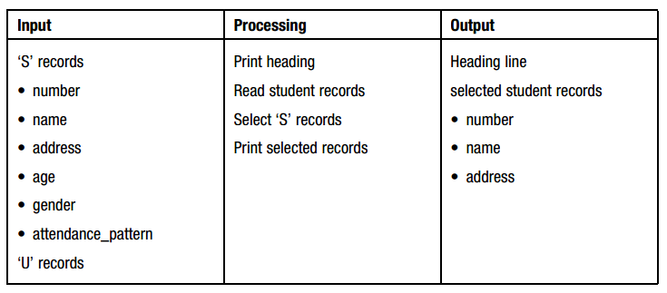

# Program Design

GitBook allows you to organize your book into chapters, each chapter is stored in a separate file like this one.

A file of student records consists of &lsquo;S&rsquo; records and&lsquo;U&rsquo; records. An &lsquo;S&rsquo; record contains&nbsp;the student&rsquo;s number, name, age, gender, address and attendance pattern &ndash; full-time&nbsp;(F/T)or part-time (P/T). A &lsquo;U&rsquo; record contains the number and name of the unit or units&nbsp;in which the student has enrolled. There maybe more than one &lsquo;U&rsquo; record for each &lsquo;S&rsquo;&nbsp;record. Design a solution algorithm that will read the file of student records and print only the student&rsquo;s number, name and address on a &lsquo;STUDENT LIST&rsquo;

&nbsp;

<h3>Defining diagram</h3>

<h3>Control structures required</h3>
<ol>
<li>a DOWHILE loop to control the repetition</li>
<li>An IF statement to select &lsquo;S&rsquo; records</li>
</ol>
<h3>Incorrect Results - find and fix the error</h3>
<pre>Print_student_records
Print &lsquo;STUDENT LIST&rsquo; heading
Read student record
        DOWHILE morerecords exist
                        IF student record = &lsquo;S&rsquo; record THEN
                             Print student_number, name, address
                        ENDIF
        ENDDO
        Read student record

END
</pre>

&nbsp;
