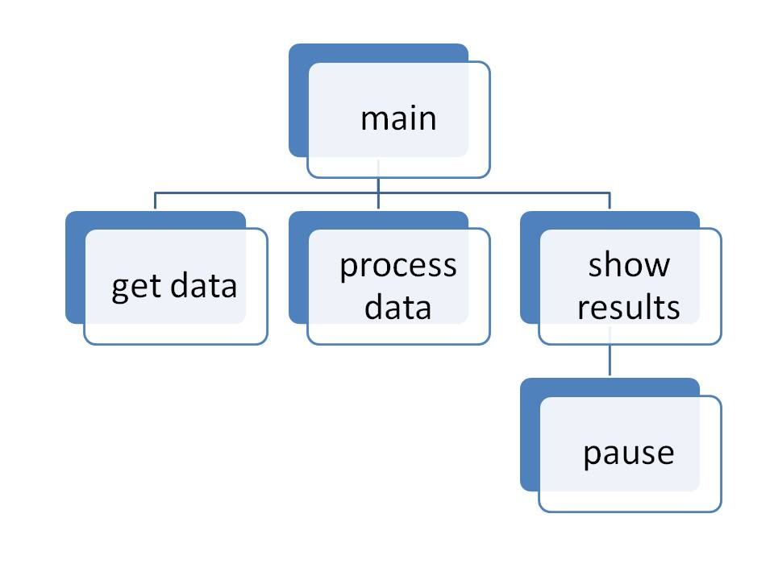

# Hierarchy Charts

The <strong>hierarchy chart</strong> (also known as a <strong>structure chart</strong>) shows the relationship of various units. Its name comes from its general use in showing the organization (or structure) of a business. The President at the top, then vice presidents on the next level, etc. Within the context of a computer program it shows the relationship between modules (or functions). Detail logic of the program is not presented. It does represent the organization of the functions used within the program showing which functions are calling on a subordinate function. Those above are calling those on the next level down.

Hierarchy charts are created by the programmer to help document a program. They convey the big picture of the modules (or functions) used in a program.

<h1>Definitions</h1>
<dl id="fs-id1166501229220" class="definition">
<dt>hierarchy chart</dt>
<dd id="fs-id1166499902777">Convey the relationship or big picture of the various functions in a program.</dd>
</dl>
<dl id="fs-id8878391" class="definition">
<dt>structure chart</dt>
<dd id="fs-id7146744">Another name for a hierarchy chart.</dd>
</dl>