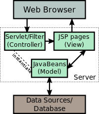

<!--djw: done -->
<!-- djw: might want to add some example jsp code -->
###JavaServer Pages (JSP)
JavaServer Pages (JSP) is a technology to create dynamically generated web pages. JSP is based on HTML, XML, or other document types. JSP is similar to PHP but uses the Java programming language. To deploy and run JavaServer Pages, a compatible web server with a servlet container is required. These include Apache Tomcat or Oracle GlassFish Application Server. The servlet container creates JSP implicit objects like pageContext, servletContext, session, request & response.

####A JSP becomes a servlet
Architecturally, JSP may be viewed as a high-level abstraction of Java servlets. JSPs are translated into servlets at runtime. Each JSP servlet is cached and re-used unless the original JSP is modified.

JSP can be used independently. It is often used as the view component of a server-side model–view–controller design. In this case Java servlets may be used as the controller. 

**Model-view-controller paradigm**  
A model-view-controller pattern can be used with the JSP files in order to split the presentation from request processing and computer data storage. Either regular servlets or separate JSP files are used to process the request. After the request processing has finished, control is passed to a JSP used only for creating the output. 

JSP allows Java code and certain pre-defined actions to be interwoven with HTML. The resulting page is compiled and executed on the server to deliver a document to the browser. The compiled pages, as well as any dependent Java libraries, contain Java bytecode. JSPs, like Servlets and other Java programs, must be executed within a Java virtual machine (JVM). The JVM interacts with the server's host operating system to provide an abstract, platform-neutral environment.

