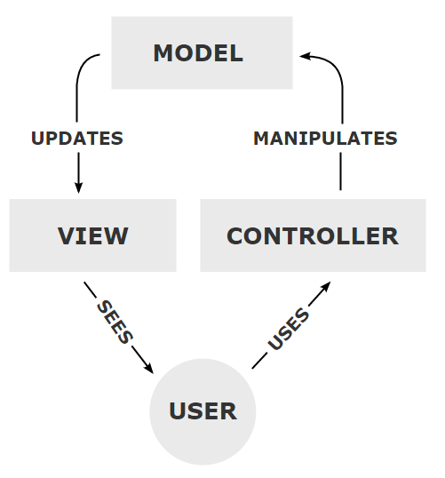

<!--djw: done -->
This course is about developing web applications. A web application is a set of web pages that meed the requirements of a user request. The Java Enterprise Edition (Java EE) specification describes how web servers interact with Java web technologies. 

The technologies we use in this course include:
* Servlets
* Plain Old Java Objects (POJO)
* JavaServer Pages (JSP)
* Java Persistence API (JPA) and Java Persistence Query Langauge (JPQL)
* Enterprise JavaBeans (EJB)
* Oracle Database
* HTML, CSS and JavaScript
* Tomcat Web Server

In your web applications you will be creating servlets and JavaServer Pages (JSP). The role of the servlets is to perform the server-side processing. The JSPs store the HTML and present the user interface through the browser. THe JSPs will contain Expression Langage and tags which the controller (a servlet) can use to populate the JSP with data. Often the data comes from a database. We will be using Oracle in this book. We use Apache Tomcat because it is a servlet/JSP engine which includes a web server.

