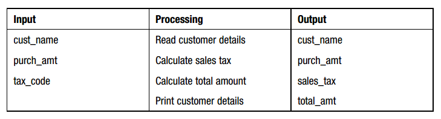

# What is a systems diagram?

###A Systems Diagram
To help you develop an understanding of a problem you should read the problem statement. You may need to ask follow-up questions before proceeding. Next, divide the problem into its components.

The solution is often to take the inputs, apply your algorithm and generate the output.

You can document this thought process in a Systems Diagram.

####Divide the problem into three components:

* Input &ndash; a list of the source data provided to the problem
* Output &ndash; a list of the outputs required
* Processing &ndash; a list of actions needed to produce the required outputs. This is also your algorithm!

|Input|Processing|Output|
|--|--|
|statementBalance|receive statementBalance||
|depositsInTransit|receive depositsInTransit||
|checksOutstanding|receive checksOutstanding||
|bankFees|receive bankFees||
|||checkbookBalance|
||Add statementBalance to depositsInTransit Subtract checksOutstanding from above total subtract bankFees from checkbookBalance
|||message if your checkbook is balanced or not

&nbsp;

